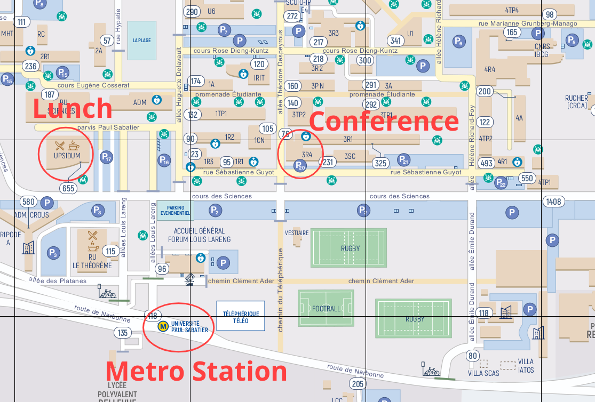

# Venue Information

The conference will take place in the [FeRMI conference room](https://www.google.com/maps?q=43.560848,1.467227) at:

**Université Paul Sabatier**  
*Bâtiment 3R4*
76 Rue Sébastienne Guyot,  
31400 Toulouse  

**GPS Coordinates:**  
- Latitude: 43.56075  
- Longitude: 1.46774

### Direction from the City Center

🚇 If you are arriving from the city center, simply hop on Metro **Line B** direction **Ramonville** and head to the **Paul Sabatier** station.

# Map

<!--- <iframe width="625" height="450" frameborder="0" scrolling="no" marginheight="0" marginwidth="0" src="https://www.openstreetmap.org/export/embed.html?bbox=1.4596205949783325%2C43.559223836036274%2C1.4720124006271365%2C43.56422281526122&amp;layer=mapnik&amp;marker=43.561723377497316%2C1.4658164978027344" style="border: 1px solid black"></iframe> <small><a href="https://www.openstreetmap.org/?mlat=43.56172&amp;mlon=1.46582#map=18/43.56172/1.46582">Display larger map</a></small> -->
 <iframe width="625" height="450" frameborder="0" scrolling="no" marginheight="0" marginwidth="0" src="https://www.openstreetmap.org/export/embed.html?bbox=1.4613743413134996%2C43.55449585969589%2C1.4737661469623038%2C43.56688766534469&amp;layer=mapnik&amp;marker=43.56062197187118%2C1.4674335459731376" style="border: 1px solid black"></iframe> <small><a href="https://www.openstreetmap.org/?mlat=43.56067&amp;mlon=1.46742#map=18/43.56069/1.46745">Display larger map</a></small>

